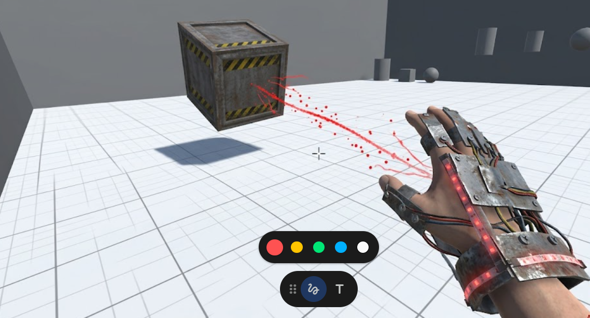

# Gear Scavenger

**Gear Scavenger** is a top-down robot combat game developed with Unity.  
The player controls a scavenger robot exploring abandoned mechanical facilities, fighting hostile machines, collecting scrap, discovering new weapons, and installing powerful Skill Core upgrades.

The objective is to survive three normal combat waves and defeat three different Boss machines during the final Boss Wave.

## Gameplay Features

- Top-down movement, aiming, shooting, and dashing
- Procedurally generated combat rooms
- Multiple enemy types with different attack mechanics
- Three unique final Bosses
- Modular weapon drops with real-time attribute comparison
- Weapon heat and overheat system
- Armor, health, scrap, and Skill Core upgrade systems
- Destructible crates, barricades, hazards, and support facilities
- Persistent weapons and upgrades between waves
- Pause menu, tutorial, HUD, victory screen, and main menu

## Enemy Types

| Enemy | Combat Role |
| --- | --- |
| Ripper Chaser | Fast melee attacker |
| Hornet Drone | Mobile ranged attacker |
| Scarab Support | Repairs nearby enemies |
| Centipede Bulwark | Armored charging enemy |
| Wasp Artillery | Long-range area attacker |
| Breaker Boss | Mixed projectile patterns |
| Siege Titan | Heavy armored Boss |
| Reactor Warden | Fast projectile-focused Boss |

## Game Modes

- **Story Mode:** Standard enemy numbers and balanced progression.
- **Challenge Mode:** Additional enemies and increased combat pressure.
- **Training Mode:** Reduced enemy squads and additional weapons, designed for practice and short demonstrations.

## Controls

| Input | Action |
| --- | --- |
| `WASD` | Move |
| `Mouse` | Aim and fire |
| `Space` | Dash |
| `E` | Compare and equip nearby weapon |
| `Q` | Release Scrap Nova |
| `F` | Activate Magnetic Guard |
| `R` | Purge weapon heat |
| `Esc` | Pause or resume |
| `F11` | Toggle fullscreen |

## Skill Cores

Skill Cores are special upgrades found inside combat rooms. Touching a Skill Core automatically installs its upgrade.

- **Kinetic Overdrive:** Improves movement speed and fire rate.
- **Coolant Matrix:** Reduces weapon heat generation.
- **Nanite Shell:** Increases armor capacity and repairs the player.
- **Salvage Magnet:** Increases scrap collection range.

## Technology

- Unity `2022.3.62f3c1`
- C#
- Unity 2D Physics
- Universal Render Pipeline
- Runtime-generated rooms, enemies, UI, and combat systems

## Running the Project

1. Clone or download this repository.
2. Open the `Game` folder with Unity `2022.3.62f3c1`.
3. Open `Assets/Scenes/SampleScene.unity`.
4. Press the Play button.

To create a Windows build, use:

`Gear Scavenger > Build Windows Demo`

## Project Documentation

- [Game Data Reference](GAME_DATA_REFERENCE.md)
- [Enemy Roster](ENEMY_ROSTER.md)
- [Room Features](ROOM_FEATURES.md)
- [Project Board](PROJECT_BOARD.md)
- [Release Playtest Checklist](RELEASE_PLAYTEST_CHECKLIST.md)
- [Credits and Licenses](CREDITS_AND_LICENSES.md)
- [Known Issues](KNOWN_ISSUES.md)

## Credits

Gear Scavenger was designed and developed by **LiLin Zhu** as a Unity game programming project.

Third-party asset information and license details are recorded in [CREDITS_AND_LICENSES.md](CREDITS_AND_LICENSES.md).
